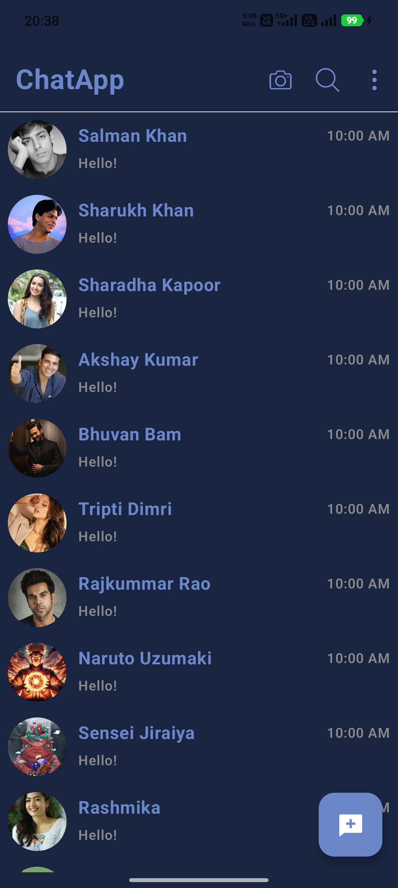
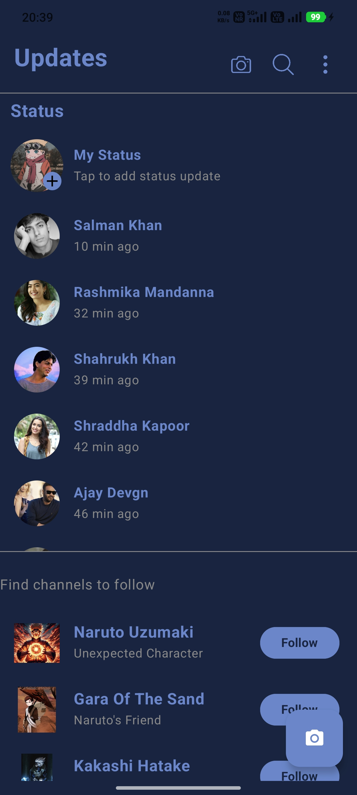
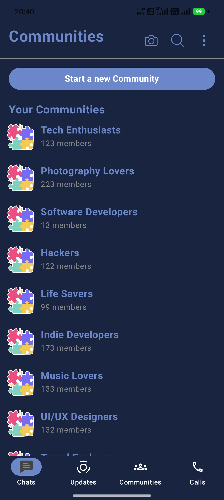
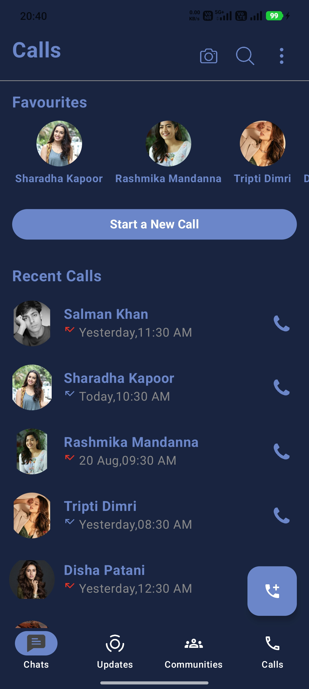

# 💬 Chat UI Design (Jetpack Compose)

A modern **Chat App UI built using Jetpack Compose**, focused on clean UI design and reusable components.
This project showcases multiple chat-related screens with smooth and minimal design.

---

## 🚀 Features

* ✨ Clean and Modern UI
* 📱 Built fully with Jetpack Compose
* 🎨 Beautiful Material 3 design
* 🔥 Reusable UI components
* ⚡ Lightweight and fast
* 🧩 Modular structure

---

## 🛠️ Tech Stack

* Kotlin
* Jetpack Compose
* Material 3
* Android Studio

---

## 📸 Screenshots

### 🟢 Splash Screen


---

### 💬 Chat UI


---

### 👤 Profile UI



---

### 📞 Calls Screen



---

### 🌐 Additional UI



---

### 🎯 Final Screen



---

## 📂 Project Structure

```bash
com.example.chatuidesign
│
├── presentation
│   ├── splashscreen
│   ├── homescreen
│   ├── callscreen
│   ├── communities
│   ├── components
│
└── ui.theme
```

---

## ⚡ Getting Started

1. Clone the repository:

```bash
git clone https://github.com/programmer-kunal/ChatUiDesign.git
```

2. Open in Android Studio

3. Run the project 🚀

---

## 🎯 Purpose

This project is built to:

* Practice Jetpack Compose UI
* Build real-world app layouts
* Improve Android UI/UX skills
* Showcase UI design in portfolio

---

## 🧠 Learning Outcomes

* Compose layouts (Row, Column, Box)
* UI structuring
* Reusable components
* Clean UI design
* Material 3 usage

---

## 👨‍💻 Author

Kunal
Android Developer 🚀

---

## ⭐ Support

If you like this project, give it a ⭐ on GitHub!
